# Python + Agents (Session 4): Building your first AI-driven workflows

📺 [Watch the full recording on YouTube](https://www.youtube.com/watch?v=FQtZCKWjARI) |
📑 [Download the slides (PDF)](https://aka.ms/pythonagents/slides/workflows)

This write-up includes an annotated version of the presentation slides with timestamps to the video plus a summary of the live Q&A sessions.

## Table of contents

- [Session description](#session-description)
- [Annotated slides](#annotated-slides)
  - [Overview of the Python and Agents series](#overview-of-the-python-and-agents-series)
  - [Building your first AI-driven workflows](#building-your-first-ai-driven-workflows)
  - [Agenda: workflow fundamentals](#agenda-workflow-fundamentals)
  - [Following along with the GitHub repo and Codespaces](#following-along-with-the-github-repo-and-codespaces)
  - [Recap: what is an AI agent](#recap-what-is-an-ai-agent)
  - [Workflows](#workflows)
  - [What is an agentic workflow](#what-is-an-agentic-workflow)
  - [Anatomy of a workflow: executors, edges, messages, and outputs](#anatomy-of-a-workflow-executors-edges-messages-and-outputs)
  - [Building a workflow with WorkflowBuilder](#building-a-workflow-with-workflowbuilder)
  - [Visualizing workflows with DevUI](#visualizing-workflows-with-devui)
  - [Workflows with Agent executors](#workflows-with-agent-executors)
  - [Streaming events from workflows](#streaming-events-from-workflows)
  - [Built-in SequentialBuilder for linear pipelines](#built-in-sequentialbuilder-for-linear-pipelines)
  - [Branching workflows](#branching-workflows)
  - [Workflow with conditional branching](#workflow-with-conditional-branching)
  - [Text output is fragile for workflow control](#text-output-is-fragile-for-workflow-control)
  - [Unstructured text vs. structured output](#unstructured-text-vs-structured-output)
  - [Using structured outputs for workflow decisions](#using-structured-outputs-for-workflow-decisions)
  - [Category-based routing with structured outputs](#category-based-routing-with-structured-outputs)
  - [Using switch-case edges in workflows](#using-switch-case-edges-in-workflows)
  - [State management](#state-management)
  - [When do we need workflow state](#when-do-we-need-workflow-state)
  - [Storing and accessing state in workflows](#storing-and-accessing-state-in-workflows)
  - [Shared workflow state leaks between requests](#shared-workflow-state-leaks-between-requests)
  - [Shared agents accumulate conversation history](#shared-agents-accumulate-conversation-history)
  - [State isolation via factory functions](#state-isolation-via-factory-functions)
  - [Using workflows in applications](#using-workflows-in-applications)
  - [Retail shop with agentic workflows](#retail-shop-with-agentic-workflows)
  - [Sequential workflow: restocking inventory](#sequential-workflow-restocking-inventory)
  - [Next steps and resources](#next-steps-and-resources)
- [Live Chat Q&A](#live-chat-qa)
- [Discord Office Hours Q&A](#discord-office-hours-qa)

## Session description

In session 4 of the Python + Agents series, we explored the foundations of building AI-driven workflows using the Microsoft Agent Framework. We started with the core concepts—executors, edges, messages, and outputs—and built a basic sequential workflow for RAG document ingestion that used no LLM at all, demonstrating that the workflow abstraction is useful beyond agentic scenarios.

From there, we showed how to plug Agent instances directly into workflows as executor nodes, building a writer-reviewer pipeline and visualizing its execution in DevUI. We covered streaming workflow events for building responsive user interfaces and introduced the built-in SequentialBuilder for common linear pipelines.

The session then moved to conditional branching, first with simple string-based condition functions, then with structured outputs (Pydantic models with Literal fields) to make routing decisions more reliable. We demonstrated switch-case edge groups for category-based routing with a default fallback.

We concluded with workflow state management—using `set_state`/`get_state` to avoid passing data through nodes that don't need it—and discussed pitfalls of shared state and agent session history across parallel runs, recommending factory functions for state isolation. A brief demo of a full-stack retail application showed how workflows integrate into user-facing interfaces.

## Annotated slides

### Overview of the Python and Agents series

[Watch from 00:54](https://www.youtube.com/watch?v=FQtZCKWjARI&t=54s)

This is a six-part live stream series on building AI agents with the Microsoft Agent Framework. Session 4 is the start of week two, which focuses on workflows. Week one covered building individual agents, adding context and memory, and monitoring and evaluation. All sessions are recorded and available along with slides, code, and annotated writeups. Registration provides email notifications for upcoming sessions at [aka.ms/PythonAgents/series](https://aka.ms/PythonAgents/series).

### Building your first AI-driven workflows

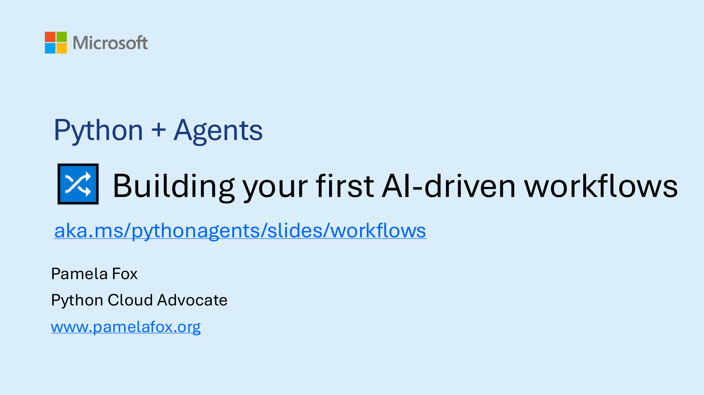
[Watch from 01:01](https://www.youtube.com/watch?v=FQtZCKWjARI&t=61s)

This session covers the fundamentals of building AI-driven workflows in Python using the Microsoft Agent Framework. Slides are available at [aka.ms/pythonagents/slides/workflows](https://aka.ms/pythonagents/slides/workflows).

### Agenda: workflow fundamentals

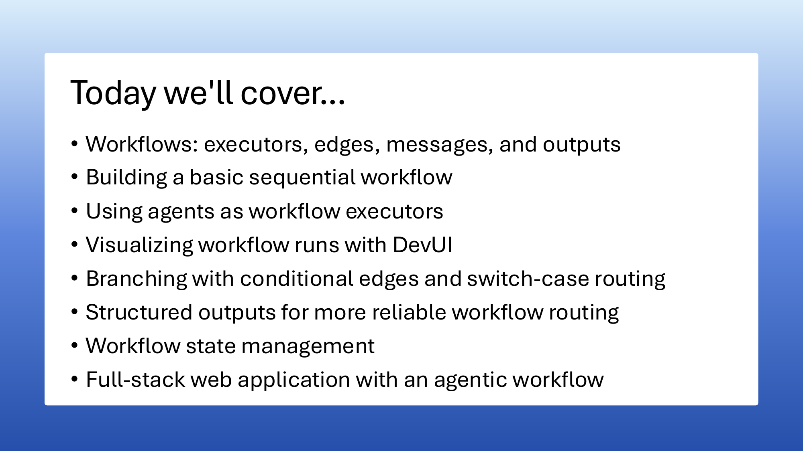
[Watch from 02:07](https://www.youtube.com/watch?v=FQtZCKWjARI&t=127s)

The agenda covers workflows (executors, edges, messages, and outputs), building a basic sequential workflow, using agents as workflow executors, visualizing workflow runs with DevUI, branching with conditional edges and switch-case routing, structured outputs for more reliable workflow routing, workflow state management, and a full-stack web application with an agentic workflow.

### Following along with the GitHub repo and Codespaces

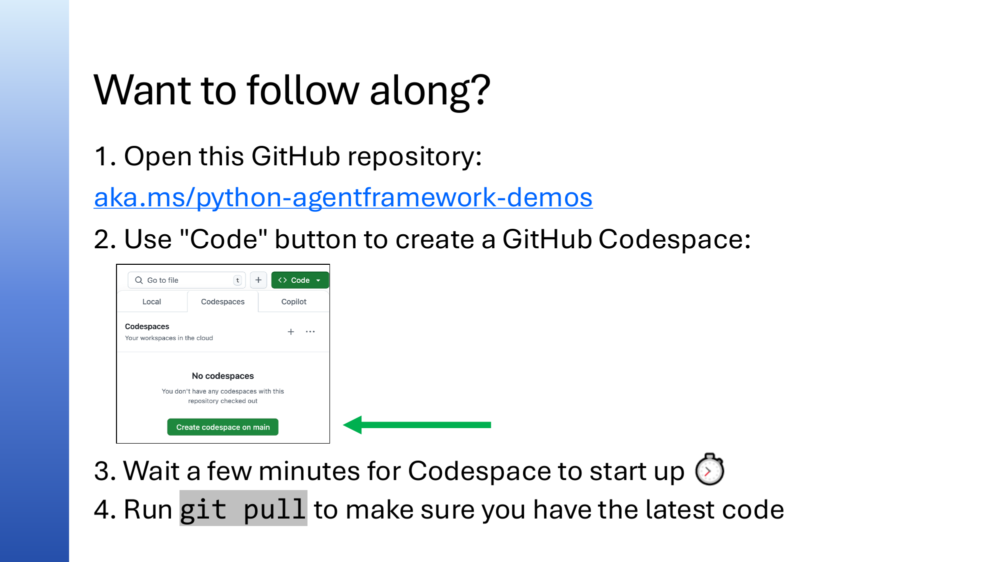
[Watch from 02:51](https://www.youtube.com/watch?v=FQtZCKWjARI&t=171s)

All code is in the same GitHub repository used throughout the series at [aka.ms/python-agentframework-demos](https://aka.ms/python-agentframework-demos). Clicking the green "Code" button and selecting "Create codespace on main" opens a preconfigured VS Code environment in the browser with Python, UV, and all dependencies installed. Running `git pull` is recommended to get the latest workflow examples, especially if reusing a Codespace from a previous session.

### Recap: what is an AI agent

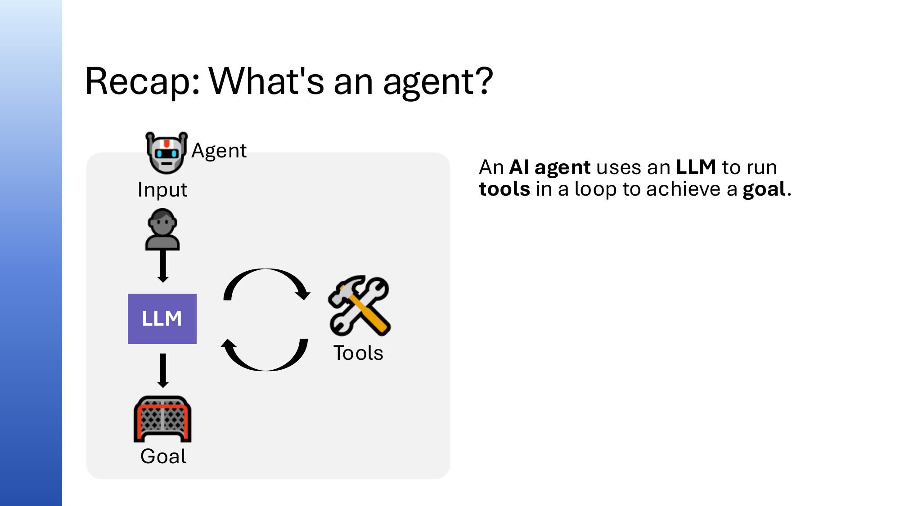
[Watch from 04:35](https://www.youtube.com/watch?v=FQtZCKWjARI&t=275s)

An AI agent uses an LLM to run tools in a loop to achieve a goal. Agents have access to tools—file operations, MCP servers for documentation, test runners—and use those tools to accomplish tasks like refactoring code or answering questions. The key is equipping agents with the right tools for their scenario. This session builds on agents by chaining them together with other components inside workflows.

### Workflows

[Watch from 06:16](https://www.youtube.com/watch?v=FQtZCKWjARI&t=376s)

This section introduces agentic workflows and the terminology used in the Microsoft Agent Framework.

### What is an agentic workflow

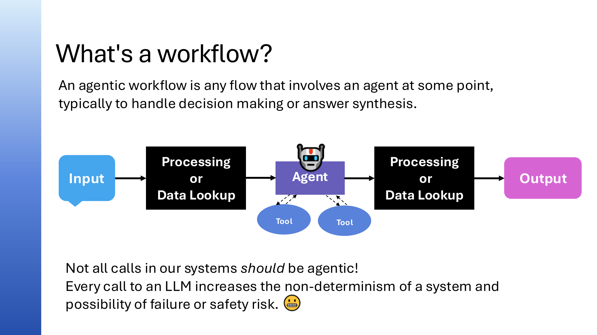
[Watch from 06:20](https://www.youtube.com/watch?v=FQtZCKWjARI&t=380s)

An agentic workflow is any flow that involves an agent at some point, typically for decision making, content generation, synthesis, or research. Agents are particularly useful at decision points that previously required complex regular expressions or keyword checks—LLMs handle fuzzy decision-making better. However, not all calls in a system should be agentic. Every LLM call increases non-determinism and the possibility of failure or safety risk. Agents should only be added where they genuinely add value or enable workflows that previously required human intervention.

### Anatomy of a workflow: executors, edges, messages, and outputs

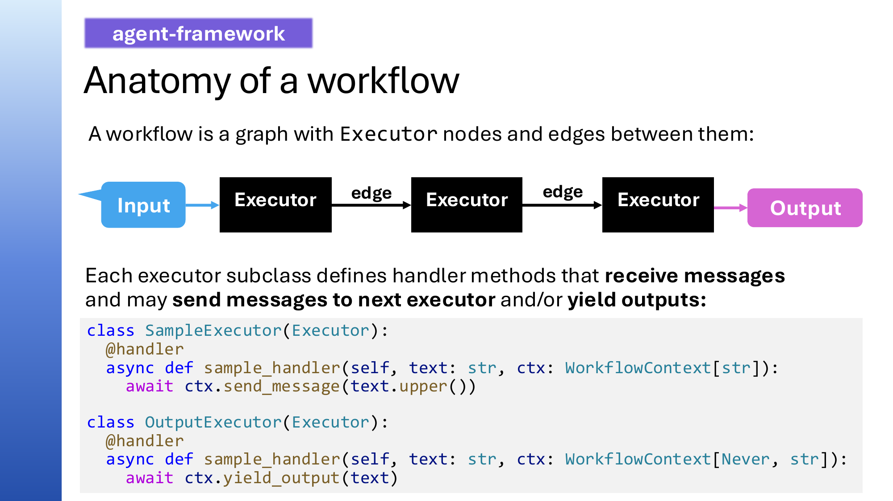
[Watch from 09:04](https://www.youtube.com/watch?v=FQtZCKWjARI&t=544s)

In the Microsoft Agent Framework, a workflow is a graph. Each node is an **Executor** and the connections between them are **edges**. Executors are Python classes that subclass `Executor` and define handler methods decorated with `@handler`. These handlers receive messages from previous executors and can either `send_message()` to the next executor or `yield_output()` to produce final workflow output. Internal executors typically send messages to pass data between nodes. The final executor yields output that can be accessed after the workflow completes. Executors can also do both—send messages and yield outputs—if intermediate results need to be accessible after the workflow ends.

### Building a workflow with WorkflowBuilder

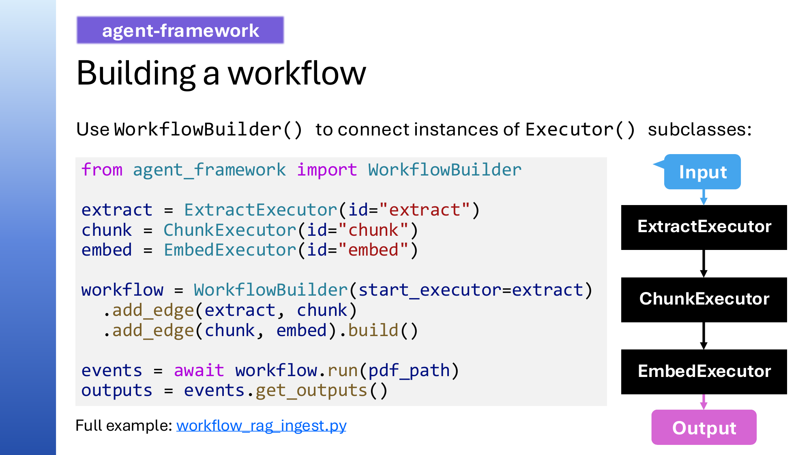
[Watch from 10:52](https://www.youtube.com/watch?v=FQtZCKWjARI&t=652s)

`WorkflowBuilder` connects executor instances into a workflow. Import it from `agent_framework`, create executor subclass instances, set a `start_executor`, then chain them with `add_edge()`. Call `.build()` to get a workflow instance, then `workflow.run()` with input to execute it.

The demo shows a RAG ingestion workflow (`workflow_rag_ingest.py`) that uses no LLM at all. It has three executors: one extracts text from a PDF using the `markitdown` package, one splits the text into paragraph chunks, and one generates vector embeddings for each chunk. Each executor's handler accepts the message type sent by the previous executor—the extract executor sends a string, the chunk executor expects a string and sends a list of strings, and the embed executor expects a list of strings and yields the final embeddings as output.

### Visualizing workflows with DevUI

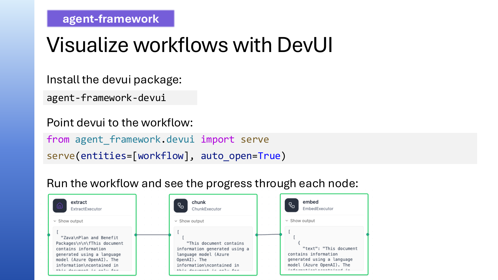
[Watch from 15:07](https://www.youtube.com/watch?v=FQtZCKWjARI&t=907s)

The agent-framework-devui package provides a built-in development UI for visualizing workflows. Import `serve` from `agent_framework.devui` and call `serve(entities=[workflow], auto_open=True)` to launch it. DevUI shows executor nodes and their connections, lets you change the layout (horizontal or vertical), and allows running the workflow with different inputs interactively. During execution, it displays the output of each node as it completes and shows granular events in a sidebar. If OpenTelemetry is enabled, spans also appear in the UI.

### Workflows with Agent executors

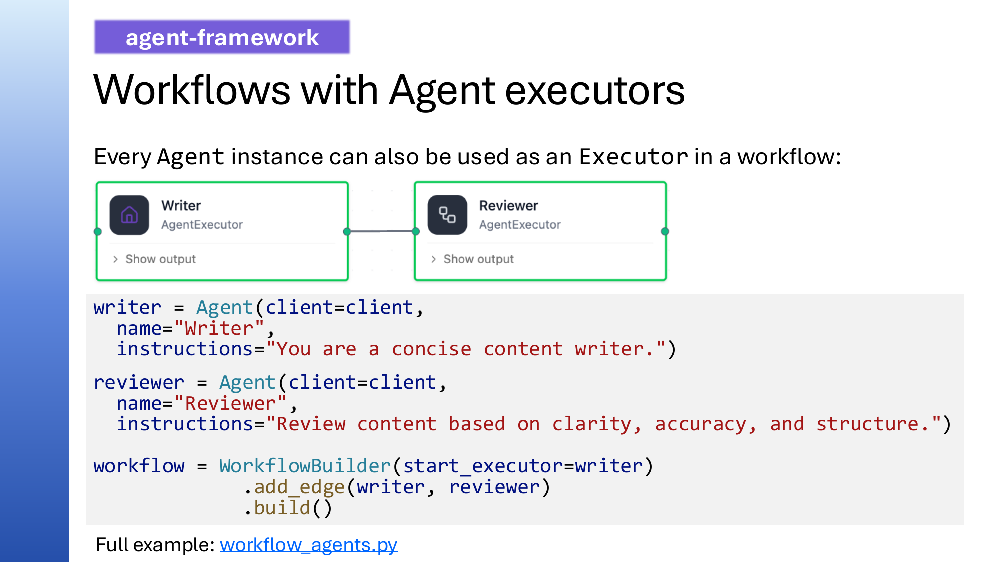
[Watch from 18:11](https://www.youtube.com/watch?v=FQtZCKWjARI&t=1091s)

Any `Agent` instance can be used directly as an executor in a workflow—the framework automatically wraps it as an `AgentExecutor`. Declare agents with `Agent(client=client, name=..., instructions=...)`, pass one as `start_executor` to `WorkflowBuilder`, and add edges between agents. The demo (`workflow_agents.py`) creates a writer agent and a reviewer agent, connects them with a single edge, and runs the workflow. In DevUI, the two agents appear as agent executor nodes. The writer produces a LinkedIn post and the reviewer provides feedback, optionally suggesting a rewrite. The writer-reviewer pattern is common because using separate agents allows different models, different tools, or different system prompts with distinct "personalities" for each step.

### Streaming events from workflows

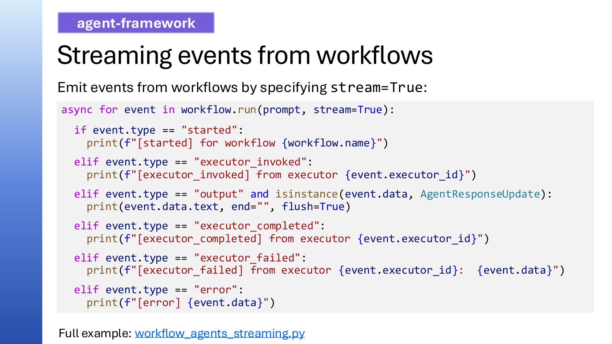
[Watch from 22:12](https://www.youtube.com/watch?v=FQtZCKWjARI&t=1332s)

Workflows emit events that can be processed one at a time by passing `stream=True` to `workflow.run()`. Event types include `started`, `executor_invoked`, `executor_completed`, `executor_failed`, `error`, and `output`. For `output` events containing `AgentResponseUpdate`, the text can be streamed token-by-token. This is essential for user-facing applications—since LLM calls are high latency, conveying progress helps users understand what the workflow is doing. DevUI is for development; production applications need custom UIs that hook into these events to show progress.

### Built-in SequentialBuilder for linear pipelines

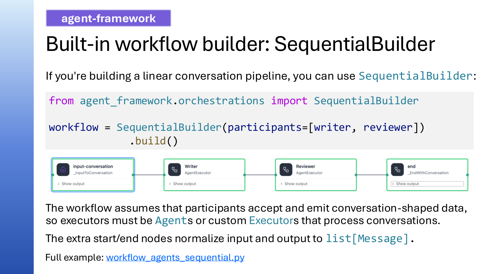
[Watch from 25:28](https://www.youtube.com/watch?v=FQtZCKWjARI&t=1528s)

`SequentialBuilder` from `agent_framework.orchestrations` simplifies creating linear workflows. Pass a list of participants and call `.build()`—no need to manually add edges. The resulting workflow has two extra nodes (input and output) that normalize data to conversation shape (`list[Message]`), since all participants in a sequential pipeline must accept and emit conversation-shaped data. This means participants must be `Agent` instances or custom executors that process conversations. The tradeoff is less flexibility but simpler code for the common case of chaining agents in a straight line.

### Branching workflows

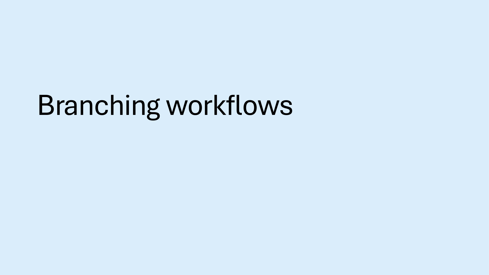
[Watch from 30:36](https://www.youtube.com/watch?v=FQtZCKWjARI&t=1836s)

This section covers how to build workflows that take different paths based on the output of a step.

### Workflow with conditional branching

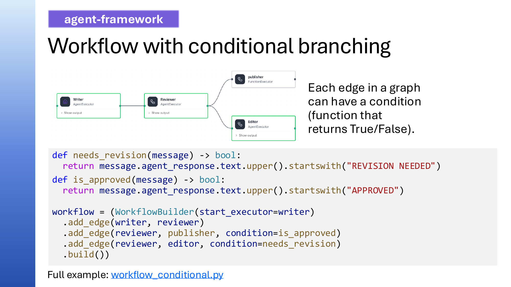
[Watch from 30:56](https://www.youtube.com/watch?v=FQtZCKWjARI&t=1856s)

Edges in a workflow can have a `condition` parameter—a function that receives a message and returns `True` or `False`. In the demo (`workflow_conditional.py`), a writer sends output to a reviewer. The reviewer's system prompt requires it to begin its response with either "APPROVED" or "REVISION NEEDED". Two condition functions check the reviewer's response text: `is_approved()` checks if it starts with "APPROVED" and `needs_revision()` checks for "REVISION NEEDED". The edge from reviewer to publisher fires if `is_approved` returns true; the edge to editor fires if `needs_revision` returns true. Which branch executes depends heavily on the model—some models are more critical than others, and randomness means different runs may take different paths.

### Text output is fragile for workflow control

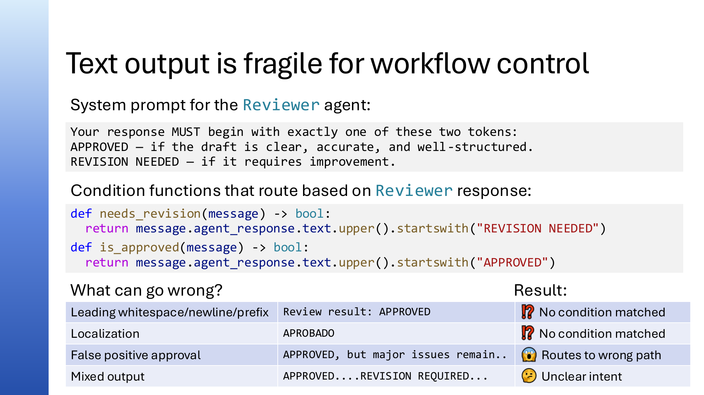
[Watch from 35:20](https://www.youtube.com/watch?v=FQtZCKWjARI&t=2120s)

Relying on free text output for routing decisions is fragile. The LLM might prepend whitespace or unexpected text before "APPROVED", causing no condition to match. It might respond in a different language if the input was in that language. It could say "APPROVED, but major issues remain..." which routes to the wrong path. It might include both "APPROVED" and "REVISION NEEDED" in the same response. There is also no fallback if neither condition matches. These problems motivate using structured outputs instead.

### Unstructured text vs. structured output

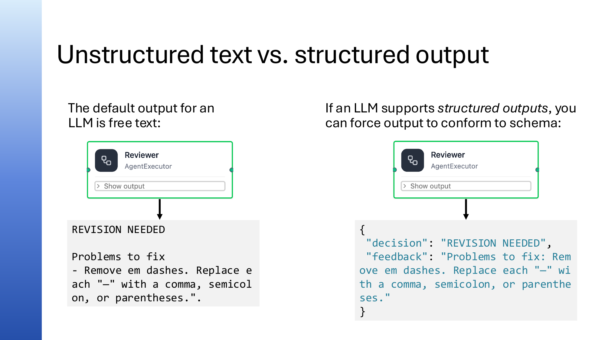
[Watch from 37:15](https://www.youtube.com/watch?v=FQtZCKWjARI&t=2235s)

The default LLM output is free text, which is fine for answering questions or generating content but problematic for decision-making, classification, or extraction. When an LLM supports structured outputs, you can force it to conform to a JSON schema. The output becomes a JSON object with explicit fields like `"decision": "REVISION NEEDED"` and `"feedback": "..."`, making it unambiguous to parse. Structured output support should ideally be part of the model's training process for best reliability. Most modern LLMs (GPT-4o, etc.) include structured output training. Local models via Ollama can force structured output but with lower reliability since it may not be part of their training.

### Using structured outputs for workflow decisions

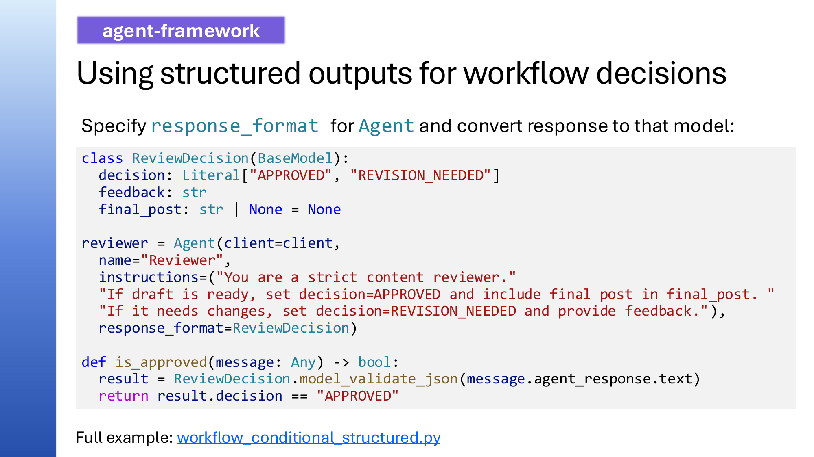
[Watch from 38:16](https://www.youtube.com/watch?v=FQtZCKWjARI&t=2296s)

Define a Pydantic `BaseModel` with a `Literal` field for the decision. In the demo (`workflow_conditional_structured.py`), `ReviewDecision` has three fields: `decision` (Literal `"APPROVED"` or `"REVISION_NEEDED"`), `feedback` (str), and `final_post` (optional str). Pass this model as `response_format` when creating the reviewer `Agent`. The LLM is then constrained to output valid JSON matching this schema. Condition functions parse the structured output using `ReviewDecision.model_validate_json()` and check `result.decision` against the exact literal string. This is far more reliable than checking whether free text starts with a particular word. The demo also adds an edge from editor back to reviewer, creating a revision loop—when the reviewer approves after a revision, the workflow proceeds to the publisher.

### Category-based routing with structured outputs

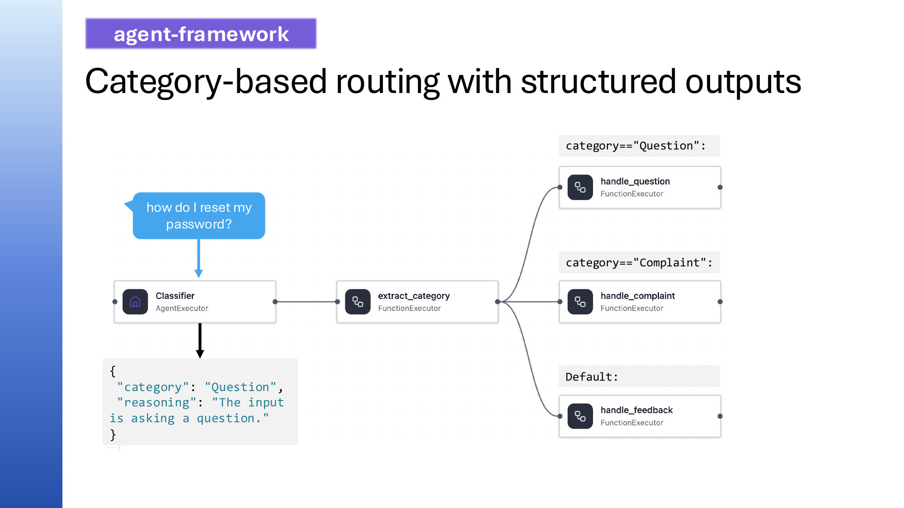
[Watch from 46:28](https://www.youtube.com/watch?v=FQtZCKWjARI&t=2788s)

A common pattern is using an agent to classify input into categories and routing to different handlers based on the classification. In a customer support scenario, a classifier agent receives "How do I reset my password?", uses structured output to classify it as a "Question" (not "Complaint" or "Feedback"), and the workflow routes to the appropriate handler. The structured output contains both the category and the reasoning behind the classification.

### Using switch-case edges in workflows

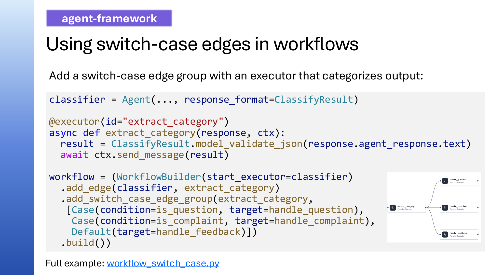
[Watch from 47:51](https://www.youtube.com/watch?v=FQtZCKWjARI&t=2871s)

`add_switch_case_edge_group()` provides switch-statement-like routing in workflows. A classifier agent produces structured output, then an `extract_category` executor parses the category from the response. The switch-case edge group routes from that executor to different targets based on `Case` conditions (e.g., `is_question`, `is_complaint`), with a `Default` target as fallback. The `Default` ensures that if no condition matches, the workflow still has somewhere to go. This is cleaner than adding many individual conditional edges and makes the default path explicit.

### State management

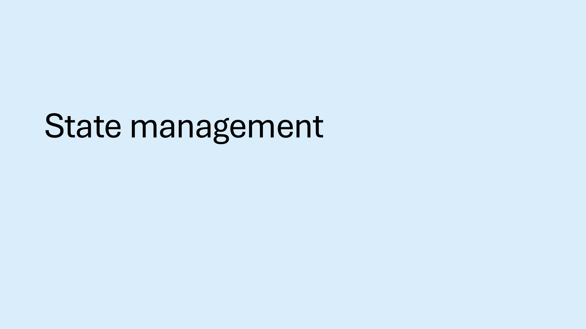
[Watch from 50:56](https://www.youtube.com/watch?v=FQtZCKWjARI&t=3056s)

This section covers managing shared state across workflow executors.

### When do we need workflow state

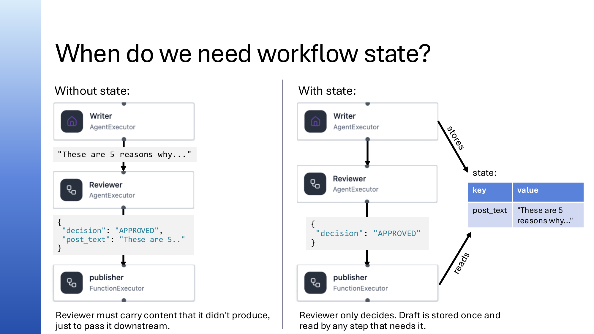
[Watch from 51:07](https://www.youtube.com/watch?v=FQtZCKWjARI&t=3067s)

Without state, every executor in a pipeline must carry along data it did not produce just to pass it downstream. In the writer-reviewer-publisher workflow, the reviewer must include the original post text in its message even though it only produced a decision. With workflow state, the writer stores the post text once and any downstream executor that needs it reads it from state. The reviewer only carries its own decision. This also reduces token usage since agents no longer need to relay content they did not create.

### Storing and accessing state in workflows

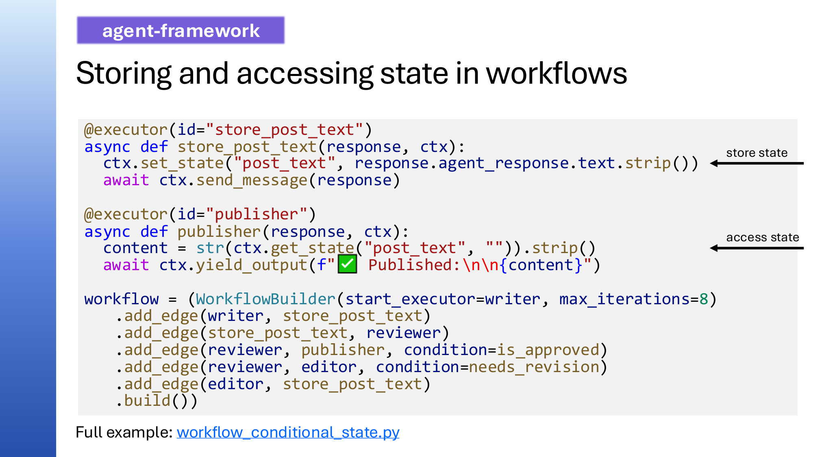
[Watch from 52:34](https://www.youtube.com/watch?v=FQtZCKWjARI&t=3154s)

Executors access workflow state through the `ctx` (WorkflowContext) parameter. Call `ctx.set_state("key", value)` to store data and `ctx.get_state("key", default)` to retrieve it. In the demo (`workflow_conditional_state.py`), a `store_post_text` pass-through executor stores the post text in state after the writer and editor produce it. Both the writer and editor route through this executor so the latest text is always in state. The publisher then reads the text from state with `ctx.get_state("post_text", "")` instead of receiving it through a message chain.

### Shared workflow state leaks between requests

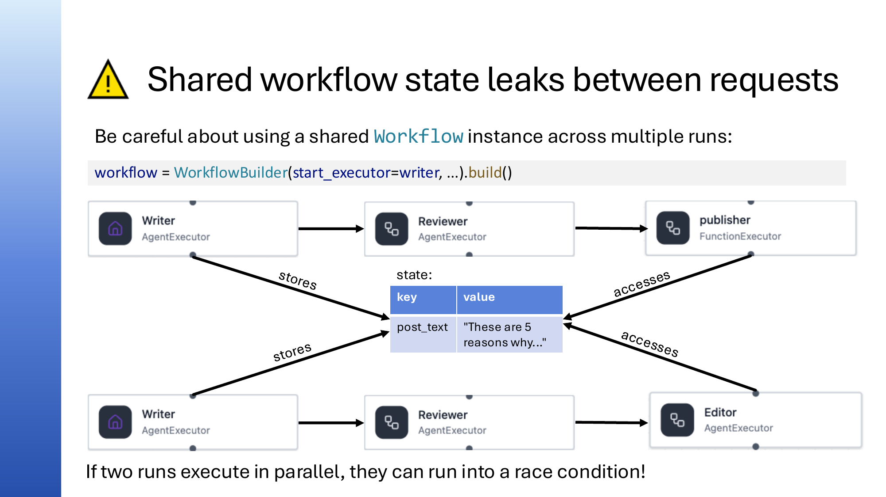
[Watch from 55:37](https://www.youtube.com/watch?v=FQtZCKWjARI&t=3337s)

A single `Workflow` instance created by `WorkflowBuilder.build()` has one shared state object. If you call `workflow.run()` multiple times in parallel with the same instance, both runs access the same state dictionary. If the state key is something generic like `"post_text"`, a race condition occurs where one run's data overwrites another's. The solution is either to build a new workflow instance for each run or to namespace state keys with a unique run identifier.

### Shared agents accumulate conversation history

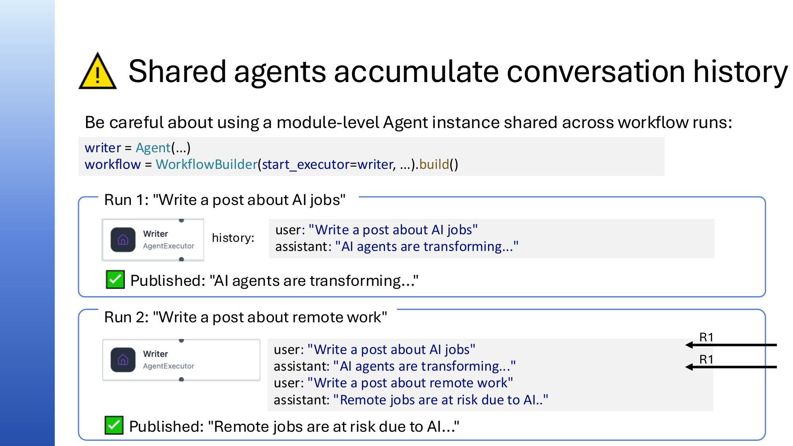
[Watch from 56:57](https://www.youtube.com/watch?v=FQtZCKWjARI&t=3417s)

Agent instances maintain their own conversation history (session). If you define agents at module level and reuse them across workflow runs, each subsequent run sees the previous run's conversation history. Run 2's writer sees the prompt and response from Run 1, which can taint its output. This is a subtler problem than shared workflow state because agents carry their own implicit state.

### State isolation via factory functions

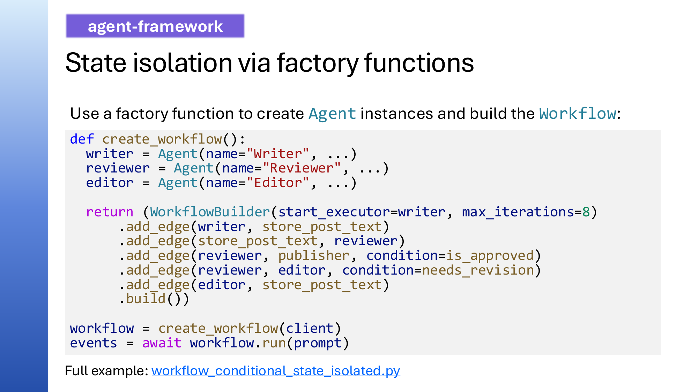
[Watch from 57:37](https://www.youtube.com/watch?v=FQtZCKWjARI&t=3457s)

The recommended pattern is a `create_workflow()` factory function that creates fresh `Agent` instances and builds a new `Workflow` each time it is called. Every invocation gets its own agents (with empty session history) and its own workflow state. Call `create_workflow()` once per prompt, run it, and discard it. This eliminates both shared state and conversation history leakage between runs. The demo is in `workflow_conditional_state_isolated.py`.

### Using workflows in applications

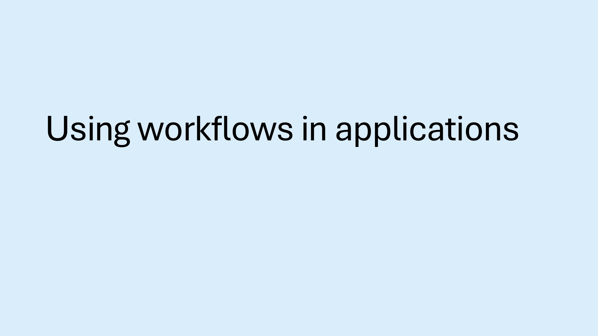
[Watch from 58:17](https://www.youtube.com/watch?v=FQtZCKWjARI&t=3497s)

This section demonstrates integrating workflows into a user-facing application.

### Retail shop with agentic workflows

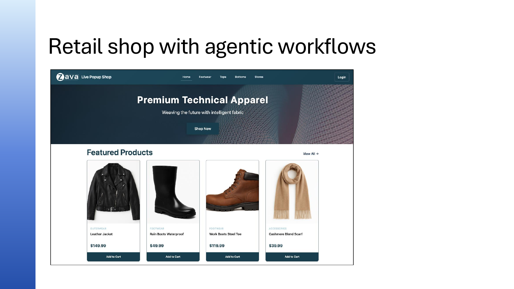
[Watch from 58:30](https://www.youtube.com/watch?v=FQtZCKWjARI&t=3510s)

The demo is a retail shop application running locally. The user is logged in as a store manager and sees 12 products running low on stock. An AI agent assists with restocking analysis. Launching the analysis triggers a workflow, and the frontend displays progress events as each agent completes—demonstrating why streaming events matters for user-facing applications. The output renders in the UI once the workflow finishes.

### Sequential workflow: restocking inventory

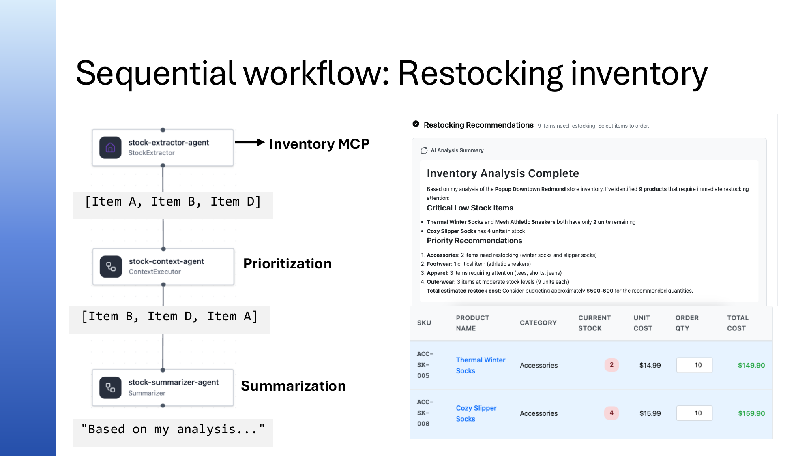
[Watch from 58:45](https://www.youtube.com/watch?v=FQtZCKWjARI&t=3525s)

The restocking workflow is a sequential pipeline with three steps. First, an agent with access to an Inventory MCP server retrieves items that are low on stock. Second, a prioritization agent reorders items by urgency. Third, a summarization agent produces a human-readable analysis. The workflow code follows the same patterns shown earlier in the session—edges connecting executors with agents wrapped automatically.

### Next steps and resources

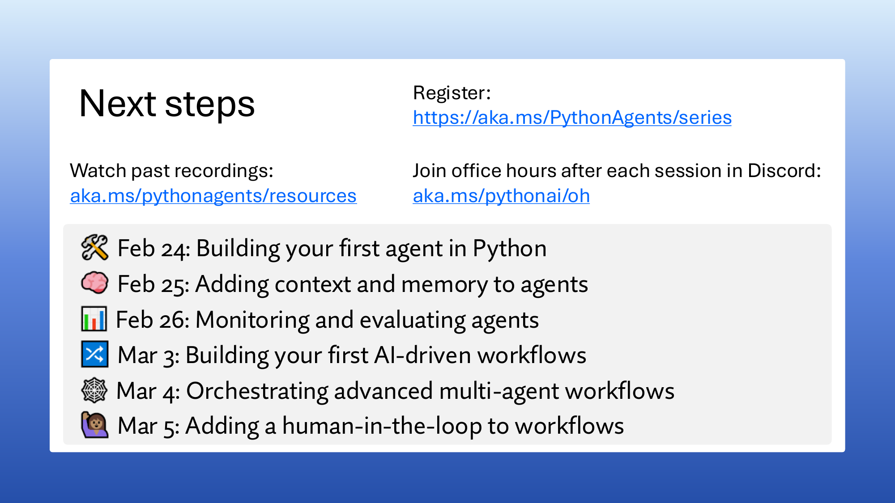
[Watch from 59:55](https://www.youtube.com/watch?v=FQtZCKWjARI&t=3595s)

Past recordings and resources are at [aka.ms/pythonagents/resources](https://aka.ms/pythonagents/resources). Office hours follow each session on Discord at [aka.ms/pythonai/oh](https://aka.ms/pythonai/oh). The remaining sessions cover orchestrating advanced multi-agent workflows (concurrency, fan-out/fan-in, aggregation) and adding a human-in-the-loop to workflows. Register at [aka.ms/PythonAgents/series](https://aka.ms/PythonAgents/series).

## Live Chat Q&A

### Is there a fallback if the reviewer doesn't return "APPROVED" or "REVISION NEEDED"?

[Watch from 35:30](https://www.youtube.com/watch?v=FQtZCKWjARI&t=2130s)

With the basic conditional edge approach using string checks, there is no fallback—if neither condition matches, the workflow has no edge to follow. This is one of the key problems with text-based routing. The switch-case edge group introduced later in the session solves this by supporting a `Default` target that catches any unmatched cases.

### Why not just have the writer review its own work instead of using two separate agents?

[Watch from 26:50](https://www.youtube.com/watch?v=FQtZCKWjARI&t=1610s)

Using a single agent with tools to self-review is valid. The advantages of separate agents are: you can use a different model entirely for reviewing (some models are better critics); you can give the reviewer access to different tools; and the reviewer can have a distinct system prompt with a "personality" that is not influenced by the writer's original prompt. If none of these advantages matter for your use case, a single agent with self-review tooling is fine.

### Does state management reduce token usage?

[Watch from 54:28](https://www.youtube.com/watch?v=FQtZCKWjARI&t=3268s)

Yes. When agents carry content they did not produce just to relay it downstream, that content consumes tokens in subsequent LLM calls. Storing data in workflow state means agents only process what is relevant to their own task. State management is essentially a mini version of memory scoped to a single workflow run.

### Is switch-case overkill for simple routing?

[Watch from 50:20](https://www.youtube.com/watch?v=FQtZCKWjARI&t=3020s)

It depends on the scenario. For two-way branching, conditional edges are straightforward. Switch-case becomes valuable when routing to many targets (three or more categories) or when you want an explicit default fallback. It also makes the code more readable when there are many conditions. Try conditional edges first; switch to switch-case if the number of branches grows or you need a guaranteed fallback.

## Discord Office Hours Q&A

## How do you stop an agent from outputting an old value in its context rather than re-running a function tool or an API call?

📹 [0:00](https://youtube.com/watch?v=UDZ8oACh_1g&t=0)

This comes up when an agent has a long conversation history and decides to use cached tool call results instead of re-calling the function — for example, an exchange rate agent returning stale rates.

The recommended approach is to use **middleware** to invalidate old tool call returns. You can base it on the summarization middleware pattern: look back at the tool call history, and if a particular tool call's result is too old (e.g., 10 minutes, an hour, 3 days — whatever makes sense for your use case), remove that tool call from the history. This forces the agent to re-call the function.

This needs to be agent-level or chat-level middleware, not function-level middleware, since the problem is that the agent isn't calling the function at all. You can also add prompt instructions telling the agent to check how old a value is, but agents don't always respect prompts, so middleware is the more reliable solution.

## How do you prevent malicious prompts from proliferating your workflows?

📹 [3:40](https://youtube.com/watch?v=UDZ8oACh_1g&t=220)

There are multiple risk mitigation layers to consider:

1. **System message and grounding**: Helpful but has limitations — prompts can only go so far.
2. **Model safety training**: Use frontier-level models that have been through rigorous RLHF (Reinforcement Learning from Human Feedback) specifically for safety. Check the model card for any new model to see what safety red teaming was done. Avoid models without published model cards.
3. **Content safety system**: On Azure, the content safety system lets you configure what gets blocked, including two kinds of jailbreak detection and protected materials detection. Models hosted on Foundry (formerly Azure AI) include these filters by default at a "medium" threshold, which you can adjust higher or lower.

The recommendation is to use Azure-deployed models since they include built-in safety layers, rather than relying solely on prompt-based protections.

## What is the recommended approach for integrating the GitHub Copilot CLI and SDK in a DevOps workflow?

📹 [7:26](https://youtube.com/watch?v=UDZ8oACh_1g&t=446)

The specific question was about analyzing CVEs in dependencies and making corrective actions on PRs.

For CI/CD automation with LLMs, [GitHub Agentic Workflows](https://github.blog/ai-and-ml/automate-repository-tasks-with-github-agentic-workflows/) is the recommended starting point. These let you write workflows in plain text with security YAML front matter (specifying permissions, allowed outputs, and tools like the GitHub MCP server), and it generates the GitHub Actions workflow file for you. This is much easier than writing workflows from scratch.

For analyzing CVEs on PRs specifically, you could set up an agentic workflow that triggers on pull requests, reads the PR contents, and analyzes dependencies — with custom MCP servers if needed.

Links shared:

* [GitHub Agentic Workflows blog post](https://github.blog/ai-and-ml/automate-repository-tasks-with-github-agentic-workflows/)
* [Copilot SDK experiments branch](https://github.com/Azure-Samples/azure-search-openai-demo/compare/main...pamelafox:azure-search-openai-demo:sdkexperiments)

## Have you tried building MAF applications using Claude Code or Codex?

📹 [12:26](https://youtube.com/watch?v=UDZ8oACh_1g&t=746)

Pamela has only used Codex once (when the Mac desktop app came out) and found it quite good, but hasn't used Claude Code. All the demo examples were built using GitHub Copilot.

The key is having a good [`AGENTS.md`](https://github.com/Azure-Samples/python-agentframework-demos/blob/main/AGENTS.md) file that tells the coding agent about the framework, repo structure, and relevant resources — Pamela shared her configuration for the demo repo, which specifies the framework, Python version, changelog location, and available MCP servers. This kind of configuration is useful regardless of which coding agent you use.

## How likely is it that a conditional workflow gets stuck in an infinite revision loop, and how do you prevent it?

📹 [14:06](https://youtube.com/watch?v=UDZ8oACh_1g&t=846)

This is very possible. Pamela experienced it herself and had to make the reviewer less critical and increase `max_iterations` (from 8 to 20 in one example). The default max iterations is 100.

Best practices for handling this:

1. **Set `max_iterations`** on your workflow to a reasonable limit.
2. **Catch the exception**: When max iterations is exceeded, the framework raises a `WorkflowConvergenceException` ("Runner did not converge"). Wrap your workflow execution in a try/except to handle this gracefully — e.g., log it, mark it for human review, or investigate which stage was too critical.
3. **Use workflow state**: You can use `set_state`/`get_state` to track revision counts and break loops intentionally via conditional edges.
4. **Design fallback edges**: Ensure conditional edges have a default fallback path that guarantees termination.
5. **Instruct the agent**: Include guidance in the system prompt about when to stop revising.

At the agent level (as opposed to the workflow level), you can use middleware to detect when an agent is making too many tool calls and intervene.

### Does the executor context include iteration count?

📹 [19:27](https://youtube.com/watch?v=UDZ8oACh_1g&t=1167)

The workflow does track iteration count internally, but it may not be directly accessible from the workflow context. If you can't access it naturally, you can use `set_state`/`get_state` to track iteration count yourself and use it in conditional edges to break out of loops.

## The switch-case workflow throws an unhandled exception when running with DevUI — is it an environment issue?

📹 [22:21](https://youtube.com/watch?v=UDZ8oACh_1g&t=1341)

It's not just your environment — Pamela hit the same bug. The error (`'NoneType' object has no attribute 'category'`) occurs when running with `--devui` but not via CLI. Multiple attendees confirmed that several switching/conditional workflows don't complete under DevUI but work fine from the command line. It was a recent regression related to how structured outputs are handled. The bug was [filed on GitHub](https://github.com/microsoft/agent-framework/issues/4437) and has already been resolved in main.

## Is there a certification about agents from Microsoft?

📹 [30:13](https://youtube.com/watch?v=UDZ8oACh_1g&t=1813)

There isn't a specific "agents" certification, but several related ones exist:

* [Azure AI Fundamentals (AI-900)](https://learn.microsoft.com/en-us/credentials/certifications/azure-ai-fundamentals/) — the fundamentals-level certification
* [Azure AI Engineer Associate (AI-102)](https://learn.microsoft.com/en-us/credentials/certifications/azure-ai-engineer/) — the associate-level certification, frequently recommended
* [Applied Skills: Create an AI Agent](https://learn.microsoft.com/en-us/credentials/applied-skills/create-an-ai-agent/) — a targeted applied skills credential

Links shared:

* [Azure AI Engineer Associate certification](https://learn.microsoft.com/en-us/credentials/certifications/azure-ai-engineer/)
* [Azure AI Fundamentals certification](https://learn.microsoft.com/en-us/credentials/certifications/azure-ai-fundamentals/)
* [Applied Skills: Create an AI Agent](https://learn.microsoft.com/en-us/credentials/applied-skills/create-an-ai-agent/)

## What LLMs or SLMs do you recommend for running workflows locally?

This question was asked in Discord chat near the end of the session but the recording cut out before it could be answered on stream. [Foundry Local](https://learn.microsoft.com/en-us/azure/foundry-local/get-started) is a tool for running models locally, available on [GitHub](https://github.com/microsoft/Foundry-Local).

## Where can I find all the course series?

This question was asked in Discord chat. Links shared:

* [Python + AI series resources](https://aka.ms/pythonai/resources)
* [Python + MCP series resources](https://aka.ms/pythonmcp/resources)
* [Python + Agents series resources](https://aka.ms/pythonagents/resources)
* [Pamela's talks page](https://pamelafox.org/talks/)
* [Pamela's Python talks slides](https://pamelafox.github.io/my-py-talks/)

## What is the status of Foundry Local for Linux?

Currently, [Foundry Local](https://github.com/microsoft/Foundry-Local) only supports Mac and Windows. There are open discussions about Linux support on the GitHub repo.
